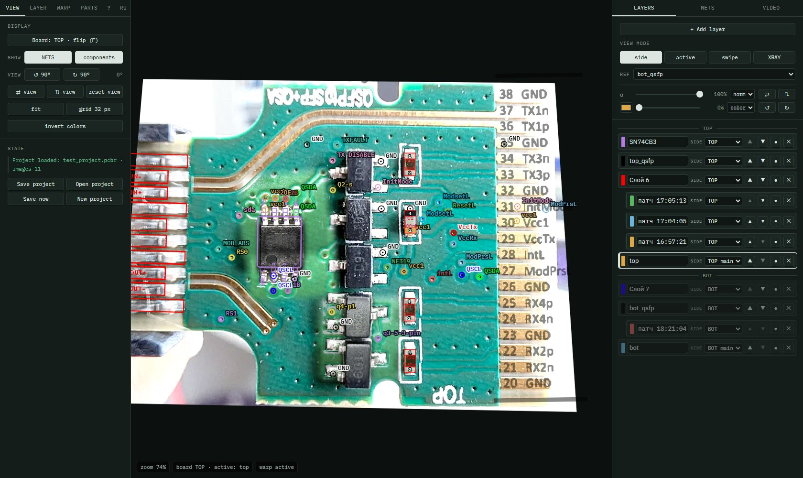
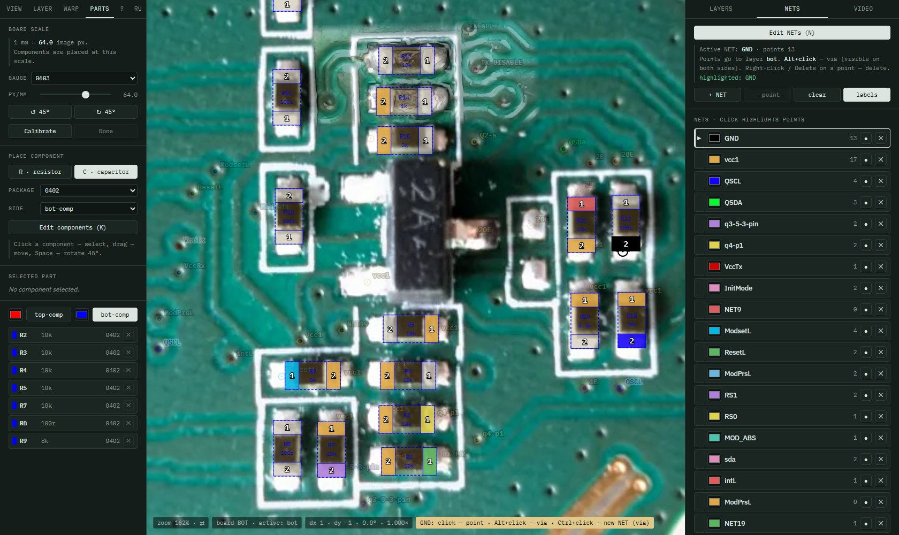

# PCBReverse

**English** | [Русский](README.ru.md)

A single-HTML-file tool for PCB reverse engineering: overlay photos and scans of both board sides,
Gerber renders and reference images from datasheets, trace nets (NET) and place SMD components.
No build, no server, no dependencies — opens straight from disk in Chrome / Edge.
The UI is in English and Russian; the **EN / RU** switch is at the right end of the left-panel tabs.



## Features

- **Layers** — photos, scans, Gerber PNGs, pinouts from datasheets; as many as you need.
  Layer side TOP / BOT / both, main layer of a side (*TOP main* / *BOT main*), opacity,
  blend modes, tint, mirroring and rotation. Ordered in TOP / BOT groups.
- **Layer alignment**
  - CorelDRAW-like free transform: frame, scale (corners — proportional, sides — one axis)
    and rotation around a movable pivot;
  - warp by reference points (2–8 pairs): similarity, affine, perspective;
  - layer crop, soft edges.
- **Image processing** — background removal by color (eyedropper, tolerance), color correction: levels, gamma,
  contrast, brightness, saturation, sharpness, posterize; presets for legible silkscreen.
- **Viewing** — board flip (F) keeping the point under the cursor in place, view modes side / active / swipe
  and XRAY (both sides at once), view rotation and mirroring, zoom to cursor.
- **NETs** — net points on a board side, vias (visible from both sides), net highlighting, labels.
- **Components** — R / C 0201…0805 at true scale (calibrated against a gauge part), pin numbers,
  automatic pin-to-NET assignment from points on the pads.
- **Video (experimental)** — a USB microscope or camera as a layer over the board or in a separate window;
  one button turns a frame into a “patch” of the side's main layer — to fill in spots that came out
  poorly on the main photo.
- **Project `*.pcbr`** — an uncompressed zip: `project.json` (all settings) + original images.
  Work is autosaved in the browser.



## Quick start

1. Download or clone the repository.
2. Open `index.html` in Chrome or Edge (double-click — works from `file://`). The demo project opens.
3. **VIEW → “New project”**, then in the **LAYERS** cards — “Choose file…” for TOP / BOT; more layers — “+ Add layer”.
4. Align the layers: left tab **LAYER → “Free transform (M)”** or **WARP** — reference points.
5. Mark up: **NETS → “Edit NETs” (N)**, **PARTS → calibrate → “Edit components” (K)**.
6. Save: left tab **VIEW → “Save project”**.

On first start (nothing saved in the browser yet) the demo project opens by itself — `tests/test_project.pcbr`:
a QSFP/SFP module, both sides, Gerbers, NETs, components. Start your own with **VIEW → “New project”**;
the demo can be opened again with **VIEW → “Open project”**.

Images given by path (older projects) are looked up in the `pcb_overlay_img/` folder next to `index.html`.
Files chosen in the file dialog are kept in the browser (IndexedDB) and go into the `.pcbr`.

## Interface

| Where | What |
|---|---|
| left **VIEW** | board flip, NET / component visibility, view, grid, invert; save, open, new project |
| left **LAYER** | active layer: angle / scale, free transform, crop, background removal, color correction |
| left **WARP** | warp by reference points |
| left **PARTS** | scale calibration, R / C placement, properties, list |
| left **?** · **RU** | key reference · language switch |
| right **LAYERS** | header: “+ Add layer”, view mode + XRAY, reference, α / tint / mirroring of the active layer; layer list |
| right **NETS** | edit mode, net list |
| right **VIDEO** | camera, overlay / window, “Patch layer” |

Side panel widths change by dragging their edge; double-click restores the default.

## Keys and mouse

| | |
|---|---|
| wheel / middle button | zoom to cursor / pan |
| **F** | flip the board (TOP ⇄ BOT) |
| **R**, **Shift+R** · **H**, **V** | rotate view 90° · mirror view |
| **1…8** · **X** | layer visibility · next active layer |
| **M** | free transform: click the layer — scale ⇄ rotate, ⊕ — pivot, Shift — 15° steps |
| **P** | warp reference points, **Z** — undo point |
| **N** | edit NETs: click — point, **Alt+click** — via, **Ctrl+click** — new NET (first point is a via) |
| **K** | edit components, **Space** / **Shift+Space** — rotate 45° |
| right-click, **Delete** | delete a point / component (N / K modes only) |
| **[ ]** | rotate the layer 0.1° (1° with Shift) |
| arrows | move the layer (M) or component (K) |
| **Esc** | leave the mode |

## Requirements and limitations

- A Chromium browser: Chrome, Edge. Needs IndexedDB, SVG filters, CSS mask, `getUserMedia` for video.
- A page opened from `file://` cannot read images by path; on the first project save it asks you
  to locate those files once.
- Autosave data lives in the browser profile. To move work between computers, use `.pcbr`.

## Development

The whole app is `index.html` (HTML + CSS + JS). Design notes and decisions are in `CLAUDE.md` (in Russian).
UI strings: markup is written in Russian and translated by the `I18N` dictionary at start;
dynamic strings use `L('рус', 'eng')`.

The smoke test (Playwright) opens `tests/test_project.pcbr` and checks alignment, warping and saving:

```bash
npm i -D playwright
node tests/smoke.js
```
