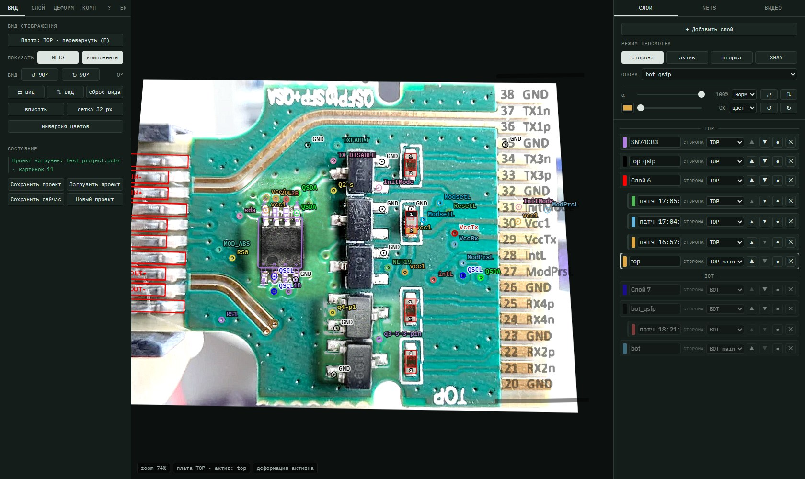
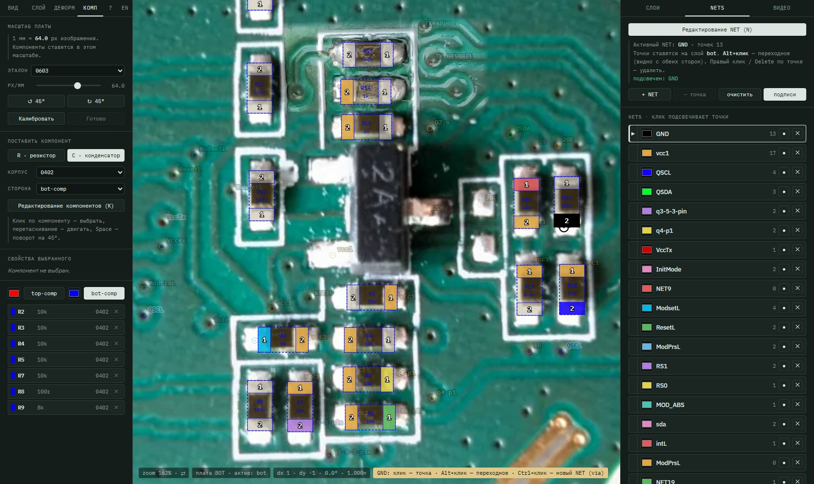

# PCBReverse

[English](README.md) | **Русский**

Инструмент для реверса печатных плат в одном HTML-файле: совмещение фото и сканов сторон платы,
герберов и справочных картинок из даташитов, разметка цепей (NET) и расстановка SMD-компонентов.
Без сборки, без сервера, без зависимостей — открывается прямо с диска в Chrome / Edge.
Интерфейс на английском и русском, переключатель **EN / RU** — в правом конце левых вкладок.



## Возможности

- **Слои** — фото, сканы, PNG из герберов, пинауты из документации; сколько угодно.
  Сторона слоя TOP / BOT / обе, главный слой стороны (*TOP main* / *BOT main*), прозрачность,
  режимы наложения, тонировка, отражения и повороты. Порядок — группами TOP / BOT.
- **Совмещение слоёв**
  - ручная деформация как в CorelDRAW: рамка, масштаб (углы — пропорционально, стороны — по одной оси)
    и вращение вокруг перемещаемого центра;
  - деформация по опорным точкам (2–8 пар): подобие, аффинная, перспектива;
  - кроп слоя, мягкие края.
- **Обработка картинки** — удаление фона по цвету (пипетка, допуск), коррекция цвета: уровни, гамма,
  контраст, яркость, насыщенность, резкость, постеризация; пресеты для читаемости шелкографии.
- **Просмотр** — переворот платы (F) с фиксацией точки под курсором, режимы «сторона» / «актив» / «шторка»
  и XRAY (обе стороны сразу), поворот и отражение вида, зум к курсору.
- **NET** — точки цепей на стороне платы, переходные отверстия (видны с обеих сторон),
  подсветка цепи, подписи.
- **Компоненты** — R / C 0201…0805 в реальном масштабе (калибровка по эталону), номера выводов,
  автоматическая привязка выводов к NET по точкам на падах.
- **Видео (экспериментально)** — USB-микроскоп или камера как слой поверх платы или в отдельном окне;
  кадр одной кнопкой встаёт «заплаткой» в главный слой стороны — дорисовать места, которые на основном
  фото получились плохо.
- **Проект `*.pcbr`** — zip без сжатия: `project.json` (все настройки) + оригиналы картинок.
  Работа автоматически сохраняется в браузере.



## Быстрый старт

1. Скачать или клонировать репозиторий.
2. Открыть `index.html` в Chrome или Edge (двойной клик — работает с `file://`).
3. Правая вкладка **СЛОИ → «+ Добавить слой»** и выбрать картинку; повторить для остальных слоёв.
4. Совместить слои: левая вкладка **СЛОЙ → «Ручная деформация (M)»** или **ДЕФОРМ** — опорные точки.
5. Размечать: **NETS → «Редактирование NET» (N)**, **КОМП → калибровка → «Редактирование компонентов» (K)**.
6. Сохранить: левая вкладка **ВИД → «Сохранить проект»**.

Пример — `tests/test_project.pcbr`: модуль QSFP/SFP, обе стороны, герберы, NET, компоненты.
Открыть: **ВИД → «Загрузить проект»**.

Картинки, заданные путём (старые проекты), ищутся в папке `pcb_overlay_img/` рядом с `index.html`.
Выбранные через диалог файлы хранятся в браузере (IndexedDB) и попадают в `.pcbr`.

## Интерфейс

| Где | Что |
|---|---|
| слева **ВИД** | переворот платы, показ NET / компонентов, вид, сетка, инверсия; сохранение, загрузка, новый проект |
| слева **СЛОЙ** | активный слой: угол / масштаб, ручная деформация, кроп, удаление фона, коррекция цвета |
| слева **ДЕФОРМ** | деформация по опорным точкам |
| слева **КОМП** | калибровка масштаба, установка R / C, свойства, список |
| слева **?** · **EN** | шпаргалка клавиш · переключение языка |
| справа **СЛОИ** | шапка: «+ Добавить слой», режим просмотра + XRAY, опора, α / тонировка / отражения активного слоя; список слоёв |
| справа **NETS** | режим редактирования, список цепей |
| справа **ВИДЕО** | камера, наложение / окно, «Дополнить слой» |

Ширина боковых панелей меняется перетаскиванием края; двойной клик — по умолчанию.

## Клавиши и мышь

| | |
|---|---|
| колесо / средняя кнопка | зум к курсору / панорама |
| **F** | перевернуть плату (TOP ⇄ BOT) |
| **R**, **Shift+R** · **H**, **V** | повернуть вид на 90° · отразить вид |
| **1…8** · **X** | видимость слоя · следующий активный слой |
| **M** | ручная деформация: клик по слою — масштаб ⇄ вращение, ⊕ — центр, Shift — шаг 15° |
| **P** | опорные точки деформации, **Z** — отменить точку |
| **N** | редактирование NET: клик — точка, **Alt+клик** — переходное, **Ctrl+клик** — новый NET (первая точка — via) |
| **K** | редактирование компонентов, **Space** / **Shift+Space** — поворот на 45° |
| правый клик, **Delete** | удалить точку / компонент (только в режимах N / K) |
| **[ ]** | поворот слоя на 0.1° (с Shift — 1°) |
| стрелки | сдвиг слоя (M) или компонента (K) |
| **Esc** | выйти из режима |

## Требования и ограничения

- Chromium-браузер: Chrome, Edge. Нужны IndexedDB, SVG-фильтры, CSS mask, `getUserMedia` для видео.
- Страница с `file://` не может прочитать картинки по путям; при первом сохранении проекта она попросит
  указать эти файлы один раз.
- Данные автосохранения живут в профиле браузера. Переносить работу между компьютерами — через `.pcbr`.

## Разработка

Всё приложение — `index.html` (HTML + CSS + JS). Заметки по устройству и решения — в `CLAUDE.md`.

Смоук-тест (Playwright) открывает `tests/test_project.pcbr` и проверяет совмещение, деформацию и сохранение:

```bash
npm i -D playwright
node tests/smoke.js
```
